# 🚀 DevOps CI/CD Pipeline Project

<p align="center">
  <b>Automated Build • Multi-Arch Docker • CI/CD • AWS Deployment</b><br>
  <i>From Code Commit → Live Application in Seconds</i>
</p>

---

## 📌 Overview

This project demonstrates a **complete end-to-end CI/CD pipeline** that automatically builds, pushes, and deploys a containerized web application to an AWS EC2 instance.

It simulates a **real-world DevOps workflow**, eliminating manual deployment and ensuring consistency across environments.

---

## 🎯 Objectives

- ⚡ Automate deployments using CI/CD  
- 🐳 Containerize applications with Docker  
- 🔐 Secure credentials using GitHub Secrets  
- 🧠 Solve cross-platform issues (ARM vs AMD64)  
- ☁️ Deploy application to AWS EC2  

---

# 🏗️ Architecture Diagram

```mermaid
flowchart LR
    A[Developer Push Code] --> B[GitHub Repository]

    B --> C[GitHub Actions Pipeline]

    C --> D[Build Docker Image]
    D --> E[Multi Arch Build AMD64 ARM64]

    E --> F[Push to DockerHub]

    F --> G[SSH to EC2]

    G --> H[Pull Latest Image]
    H --> I[Stop Old Container]
    I --> J[Run New Container]

    J --> K[Live Application on EC2]

```


---


## ⚙️ Tech Stack

- **Version Control:** Git, GitHub
- **CI/CD:** GitHub Actions
- **Containerization:** Docker
- **Cloud:** AWS EC2
- **Web Server:** Nginx
- **Frontend:** HTML, CSS, JavaScript

---

## 🔄 CI/CD Pipeline Flow

### 1️⃣ Code Push
- Developer pushes code to GitHub (`main` branch)

### 2️⃣ CI Phase (Build)
- GitHub Actions triggers automatically
- Docker image is built using **Docker Buildx**
- Multi-architecture support (`amd64`, `arm64`)

### 3️⃣ Push Phase
- Image is pushed to DockerHub repository

### 4️⃣ CD Phase (Deploy)
- Pipeline connects to EC2 via SSH
- Pulls latest image
- Stops old container
- Runs updated container

---

## 🧠 Key Concepts Implemented

### 🔹 Containerization
Application is packaged using Docker to ensure consistency across environments.

---

### 🔹 Multi-Architecture Support
Handled ARM (local machine) vs AMD64 (EC2) issue using:

```bash
docker buildx build --platform linux/amd64,linux/arm64
```
###🔹 CI/CD Automation
	•	No manual deployment
	•	Fully automated workflow using GitHub Actions

⸻

###🔹 Secure Secrets Management

Sensitive data stored in GitHub Secrets:
	•	DockerHub credentials
	•	EC2 SSH key

⸻

###🔹 Remote Deployment

Used SSH action to execute deployment commands on EC2.

⸻
```bash
##📂 Project Structure
project/
│
├── app/
│   ├── index.html
│   ├── style.css
│   └── script.js
│
├── Dockerfile
├── nginx.conf
└── .github/
    └── workflows/
        └── cicd.yml
```
🌐 Application Features
	•	Simple web UI with styling
	•	JavaScript-based interaction
	•	Dynamic deployment verification
	•	Responsive layout

⸻

🚀 How to Run Locally
```bash
# Build Docker image
docker build -t devops-app .

# Run container
docker run -d -p 80:80 devops-app
```
☁️ Deployment

Application is deployed on:
	•	AWS EC2 instance
	•	Docker container running Nginx

Access:http://<EC2-PUBLIC-IP>

🔥 Improvements & Future Enhancements

🔹 1. Zero-Downtime Deployment

Implement Blue-Green deployment using reverse proxy.

⸻

🔹 2. Kubernetes Deployment

Move from single EC2 to Kubernetes cluster (EKS/AKS).

⸻

🔹 3. Infrastructure as Code

Use Terraform to provision infrastructure.

⸻

🔹 4. Monitoring & Logging

Integrate:
	•	Prometheus
	•	Grafana

⸻

🔹 5. CI/CD Enhancements
	•	Add rollback strategy
	•	Add test stage before deployment
	•	Add image vulnerability scanning

⸻

💡 Learnings
	•	Real-world CI/CD pipeline implementation
	•	Debugging Docker architecture issues
	•	Secure automation practices
	•	Cloud-based deployment strategies

⸻

📌 Conclusion

This project showcases a complete DevOps workflow, covering:
	•	Code → Build → Deploy → Run

It demonstrates practical knowledge required for DevOps roles and reflects real-world deployment strategies.

⸻

👤 Author

Vigneshwari

DevOps & Cloud Enthusiast 🚀
